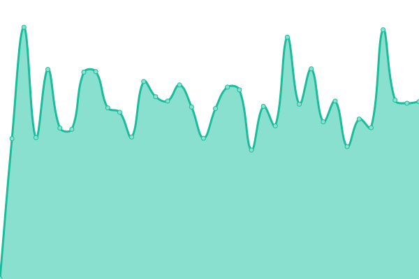
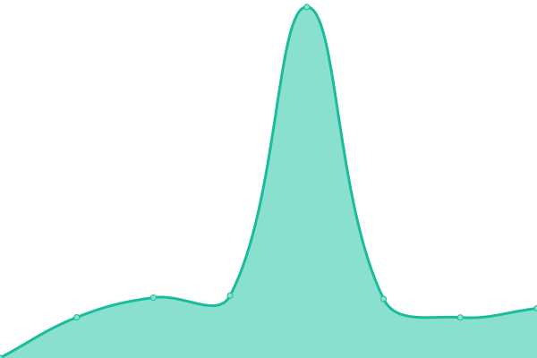
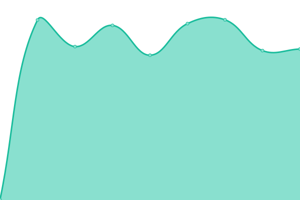

# [📈 Live Status](https://status.noxx.pro): <!--live status--> **🟩 All systems operational**

This repository contains the open-source uptime monitor and status page for [Lucas Balbino](https://status.noxx.pro), powered by [Upptime](https://github.com/upptime/upptime).

With [Upptime](https://upptime.js.org), you can get your own unlimited and free uptime monitor and status page, powered entirely by a GitHub repository. We use [Issues](https://github.com/lucasbalbino10/verificacaodedominio/issues) as incident reports, [Actions](https://github.com/lucasbalbino10/verificacaodedominio/actions) as uptime monitors, and [Pages](https://status.noxx.pro) for the status page.

<!--start: status pages-->
<!-- This summary is generated by Upptime (https://github.com/upptime/upptime) -->
<!-- Do not edit this manually, your changes will be overwritten -->
<!-- prettier-ignore -->
| URL | Status | History | Response Time | Uptime |
| --- | ------ | ------- | ------------- | ------ |
|  [Esus Arara Cloud](https://esusarara.cloud) | 🟩 Up | [esus-arara-cloud.yml](https://github.com/lucasbalbino10/verificacaodedominio/commits/HEAD/history/esus-arara-cloud.yml) | 

 587ms
     
 | 

<a href="https://status.noxx.pro/history/esus-arara-cloud">84.32%</a>
    

|  [Admin Noxx](https://admin.noxx.pro) | 🟩 Up | [admin-noxx.yml](https://github.com/lucasbalbino10/verificacaodedominio/commits/HEAD/history/admin-noxx.yml) | 

 657ms
     
 | 

<a href="https://status.noxx.pro/history/admin-noxx">100.00%</a>
    

|  [Registra Ponto](https://registraponto.com/ponto) | 🟩 Up | [registra-ponto.yml](https://github.com/lucasbalbino10/verificacaodedominio/commits/HEAD/history/registra-ponto.yml) | 

 792ms
     
 | 

<a href="https://status.noxx.pro/history/registra-ponto">100.00%</a>
    

|  [PPCE Noxx](https://ppce.euestudei.com) | 🟩 Up | [ppce-noxx.yml](https://github.com/lucasbalbino10/verificacaodedominio/commits/HEAD/history/ppce-noxx.yml) | 

 607ms
     
 | 

<a href="https://status.noxx.pro/history/ppce-noxx">100.00%</a>
    

<!--end: status pages-->

[**Visit our status website →**](https://status.noxx.pro)

## 📄 License

- Powered by: [Upptime](https://github.com/upptime/upptime)
- Code: [MIT](./LICENSE) © [Anand Chowdhary](https://anandchowdhary.com), supported by [Pabio](https://pabio.com)
- Data in the `./history` directory: [Open Database License](https://opendatacommons.org/licenses/odbl/1-0/)
